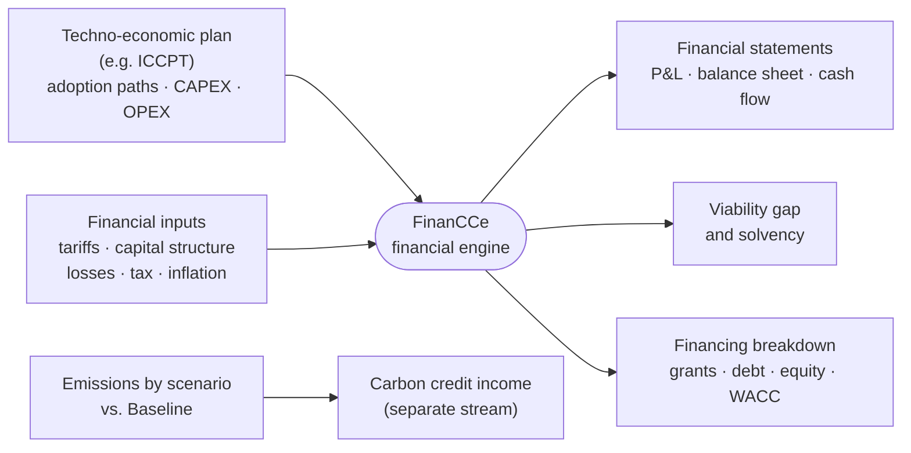

<div align="center">

<picture>
  <source media="(prefers-color-scheme: dark)" srcset="docs/img/financce_logo_dark.svg">
  
</picture>

### Open-source financial feasibility for clean cooking transitions at country scale

[](https://www.python.org/)
[](https://streamlit.io/)
[](https://fastapi.tiangolo.com/)
[](LICENSE)
[](https://www.seforall.org/publications/the-national-integrated-clean-cooking-planning)
[](https://www.seforall.org/)

[Overview](#overview) · [How it works](#how-it-works) · [Methodology](#methodology) · [Validation](#validation) · [Quickstart](#quickstart) · [Walkthrough](#first-time-user-walkthrough) · [Publications](#publications-and-how-to-cite)

</div>

<!--  -->

---

## Overview

FinanCCe is a Streamlit-based application with a Python API backend designed to evaluate and compare financing strategies for previously defined techno-economic plans. The tool supports the analysis of alternative financial structures by allowing users to configure tariffs, capital and debt structures, grants, and other financing mechanisms, and to assess their impacts on overall project viability. While originally centered on electricity-based systems, FinanCCe also enables the definition and evaluation of alternative market fuels such as LPG, ethanol, and advanced cookstoves, allowing consistent comparison across different energy carriers.

FinanCCe enables side-by-side comparison of different financing strategies applied to the same techno-economic configuration, helping users understand trade-offs across cost recovery, capital allocation, and long-term financial performance. The Streamlit frontend provides an interactive user interface, while the backend (served with Uvicorn) handles calculations and supporting services.

> [!NOTE]
> **Why FinanCCe?** Techno-economic planning tools tell planners *which* clean cooking technologies households should adopt, where, and when. They do not tell them whether that plan can be **financed**: they produce no financial statements, do not model how tariffs recover costs, and do not quantify the support a plan requires. FinanCCe supplies that missing layer. It implements, for clean cooking, the regulatory–financial framework for universal access of Díaz-Pastor et al. (2026) and Díaz-Pastor & Pérez-Arriaga (2025), and it grounded the financial analysis of **Rwanda's National Integrated Clean Cooking Planning** (SEforALL, Universidad Pontificia Comillas & MIT, 2026).

| | |
|---|---|
| 📊 **Integrated financial statements** | P&L, balance sheet and cash flow for every fuel market and scenario, with the balance-sheet identity enforced in every period |
| 🕳️ **Viability gap, as an output** | The yearly support a plan needs to stay viable is computed from cost of service and revenues, never assumed |
| 🏦 **Blended capital structures** | Grants, debt with grace and amortization periods, equity and the resulting WACC, per fuel market |
| 🔥 **Multi-fuel** | Electricity (basic access and e-cooking), LPG, ethanol, advanced cookstoves and user-defined fuel markets |
| 🌍 **Carbon as a separate stream** | Certification, liquidity and price assumptions tested without distorting the core financial picture |
| 🔍 **Auditable and reproducible** | Declarative financial formulas, Excel templates in and out, validated against a national reference model |

---

## How it works



---

## Key Capabilities

- **Financing strategy evaluation**  
  Analyze multiple financing approaches for a given techno-economic design, including variations in tariffs, grants, equity, and debt structures.

- **Capital structure definition**  
  Configure debt-to-equity ratios, financing terms, and capital allocation assumptions to reflect different investment strategies.

- **Tariff and revenue modeling across energy carriers**  
  Define and compare tariff schemes and revenue mechanisms not only for electricity-based systems, but also for alternative market fuels such as LPG, ethanol, and advanced cookstoves.

- **Multi-fuel market representation**  
  Pivot from electricity-centric analyses to model different fuel markets, enabling the evaluation of financing strategies for diverse energy access and clean cooking solutions.

- **Grant and subsidy analysis**  
  Incorporate grants and other non-repayable funding sources to assess their impact on capital requirements and financial performance.

- **Scenario comparison**  
  Compare alternative financing strategies side by side under consistent techno-economic assumptions.

- **Interactive exploration**  
  Use an intuitive Streamlit interface to explore assumptions, update parameters, and immediately visualize results.

- **Viability gap and solvency**  
  Quantify, year by year, the long-term subsidies a plan needs to remain viable, and flag any period in which closing cash turns negative.

- **Integrated financial statements**  
  P&L, balance sheet and cash flow computed as a chained system, with circular dependencies (taxes, support, cost of service) resolved iteratively.

- **Marginal e-cooking analysis**  
  Separate basic electricity access from the e-cooking layer to price the cooking transition on its own terms.

- **Carbon revenue as a separate stream**  
  Test certification share, liquidity and price assumptions without altering the core financial statements.

---

## Methodology

For each fuel market and scenario, the Regulatory Asset Base evolves as

```math
RAB_t = RAB_{t-1} + CAPEX_t - D\&A_t
```

The annual cost of service is

```math
ACoS_t = WACC \cdot RAB_t + OPEX_t + D\&A_t + \Delta WC_t + Upstream_t + Taxes_t
```

where $`\Delta WC_t`$ is the change in working capital and $`Upstream_t`$ the cost of the energy commodity (e.g. imported LPG, electricity for the cooking load). The allowed return uses the weighted average cost of capital, with the tax shield on debt:

```math
WACC = \frac{E}{E+D}\, r_E + \frac{D}{E+D}\, r_D\,(1-\tau)
```

The viability gap, reported as *long-term subsidies*, is the shortfall of tariff revenues against the cost of service, floored at zero:

```math
LTS_t = \max\{0,\; ACoS_t - TariffRev_t\}
```

The circular dependency between taxes, support and cost of service is solved iteratively (see `CIRCULAR_MAX_ITER` and `CIRCULAR_TOLERANCE` in `backend/excel_formula_engine.py`). Carbon credit income is computed against a reserved **Baseline** scenario from the certified share of avoided emissions, market liquidity, the price per tonne and the crediting period, and is reported separately from the financial statements.

---

## Validation

FinanCCe was validated against the reference financial model of Rwanda's National Integrated Clean Cooking Planning (Garrido García-Pita, 2026):

| Check | Result |
|---|---|
| ✅ Head-to-head comparison with the NICCP reference model | Outputs match variable by variable, year by year, for every fuel market, across three scenarios (Baseline, CleanStep, Aligned) over 2023–2034 |
| ✅ Balance-sheet consistency | The balance sheet closes in every period, with discrepancies of the order of 10⁻¹⁰ M$ |
| ✅ Iterative solver convergence | Convergence in two to three iterations, with residuals of the order of 10⁻¹³ |

The platform has also been made available to SEforALL for clean cooking financial planning.

---

## Example: Rwanda

The repository ships with the Rwanda case (`backend/Rwanda/`): the Baseline (BAU), **Aligned** and **CleanStep** plans evaluated in the NICCP, with a 2023–2034 horizon, a 28% corporate tax rate and 5% inflation. Select *Rwanda* on the country selector to reproduce the analysis.

---

## Repository Structure

<details>
<summary>Show repository tree</summary>

```
CC-WBT/
├── backend/
│   ├── main.py                    # API (FastAPI, served with Uvicorn)
│   ├── excel_formula_engine.py    # Formula engine and iterative solver
│   ├── formulas_map.json          # Declarative financial formulas
│   ├── config.json                # Countries, year ranges, tax, inflation, models, fuels
│   ├── {templates}/               # Excel input/output templates
│   └── Rwanda/                    # Rwanda NICCP case
├── frontend/
│   ├── app.py                     # Streamlit entry point
│   ├── modules/                   # One module per application section
│   ├── components/                # Header, sidebar, footer
│   └── state/                     # Session state
└── requirements.txt
```

</details>

---

## System Prerequisites

Before installing FinanCCe, ensure that the following requirements are met on your system:

- **Python 3.9 or newer**  
  Python must be installed and accessible from the command line.
  You can check your Python version with:

```bash
python --version
```

- **Git** (optional but recommended)  
  Required only if you choose to clone the repository instead of downloading it as a ZIP.

---

## Quickstart

This section describes the fastest ways to get FinanCCe running locally. You can either clone the repository using Git (recommended) or download the source code directly from GitHub.

### Option A: Clone the repository (recommended)

Cloning the repository ensures you can easily pull updates and track changes over time.

```bash
git clone https://github.com/SEforALL-IEAP/CC-WBT.git
cd CC-WBT
```

### Option B: Download the source code

If you prefer not to use Git, you can download the repository as a ZIP file:

1. Go to the **CC-WBT** GitHub repository.
2. Click **Code → Download ZIP**.
3. Extract the ZIP file to a local directory.
4. Open a terminal and navigate to the extracted folder:

```bash
cd CC-WBT
```

Once the source code is available locally (via cloning or download), you can proceed with environment setup and installation.

---

## Installation

### 1) Create a virtual environment

It is strongly recommended to install FinanCCe inside a virtual environment to avoid dependency conflicts.

From the project root directory (`CC-WBT`), run:

```bash
python -m venv venv
```

Activate the virtual environment:

**Windows (PowerShell):**
```bash
.\venv\Scripts\Activate.ps1
```

**Windows (Command Prompt):**
```bash
.\venv\Scripts\activate.bat
```

**macOS / Linux:**
```bash
source venv/bin/activate
```

Once activated, your terminal prompt should indicate that the venv environment is active.

### 2) Install dependencies

With the virtual environment activated, install the required Python packages:

```bash
pip install -r requirements.txt
```

This will install all dependencies needed to run both the backend API and the Streamlit frontend.

## Running the Application

Running FinanCCe requires **two terminals** to be open at the same time:
- one for the backend API (Uvicorn), and
- one for the Streamlit frontend.

Make sure the virtual environment is activated in **both** terminals.

---

### Terminal 1: Start the backend API

From the project root directory, run:

```bash
cd backend
uvicorn main:app --reload --port 8001
```

This will start the backend service on `http://localhost:8001`.  
Keep this terminal open while using the application.

---

### Terminal 2: Start the Streamlit frontend

Open a second terminal, activate the virtual environment, and run:

```bash
cd frontend
streamlit run app.py --server.port 8501
```

Streamlit will automatically open your default web browser at http://localhost:8501

---

## First-Time User Walkthrough

When the Streamlit interface opens in your browser:

1. **Cover screen**  
   The application opens on a cover screen. Click **Select scenario** to enter the main application.

2. **Select or create a country/context**  
   Choose one of the previously created countries/contexts from the selector, or create a new one.  
   When creating a new country, you will be prompted to define: **country name**, **corporate tax rate**, and **estimated inflation rate**.

3. **Start modeling**  
   Once a country has been selected or created, click **Start modeling** to proceed to the main modeling interface.

4. **Application layout and navigation**

   Once the modeling interface loads, the application is organized into two main areas:

   - **Left navigation bar**  
     The left sidebar is used to navigate across the different sections of the application. From here, you can:
     - go back to country selection,
     - access financial inputs,
     - manage techno-economic models, and
     - navigate to output sections.

   - **Central workspace**  
     The central window is the main working area of the application. Depending on the selected section from the left navigation bar, this area is used to:
     - input and edit techno-economic or financial data, or
     - visualize results, summaries, and outputs generated by the model.  

5. **Define techno-economic inputs**

   After entering the modeling interface, you can define and manage the techno-economic inputs associated with the selected country.

   - **Set the year range**  
     First, define the modeling year range. If you attempt to change the year range after inputs have already been defined, the application will prompt you with a confirmation message to ensure that existing inputs are ready to be updated or reset.

   - **Manage existing techno-economic models**  
     Any previously created or loaded techno-economic models will appear in the list. For each model, you can:
     - **Download current inputs** as Excel files,
     - **Download an Excel template** to populate inputs offline and upload them back into the application,
     - **Upload template inputs** from Excel files, or
     - **Delete the model** if it is no longer needed.

   - **Create a new techno-economic model**  
     To define a new model, provide a **model name** and click **Create**.  
     The new model will then be available for input definition, editing, and comparison.

   This workflow allows users to either define inputs directly through the interface or manage them efficiently using Excel-based templates, while maintaining consistency across modeling years and scenarios.

6. **Define financing assumptions (common across strategies)**

   After (or before) creating the techno-economic models, you can configure the **financing assumptions**. These assumptions are **common to all techno-economic models** and are managed through the **left navigation bar** under *Financial Inputs*.

   Financing inputs are organized by market and revenue stream, and are defined over the selected modeling year range.

   - **Electricity financial inputs**  
     When selecting *Electricity* from the left navigation bar, the central workspace displays a table where you can define electricity-related financial parameters, including:
     - expected **non-technical losses**,
     - **trade receivables** (days of revenues),
     - **trade payables** (days of OPEX costs).

     These parameters are specified on a yearly basis and apply consistently across all financing strategies.

   - **Fuel market financial inputs (e.g. LPG, ethanol, advanced cookstoves)**  
     Additional fuel markets can be selected from the left navigation bar or created using the *Add new fuel market* option. For each fuel market, the user can define the corresponding financial assumptions in a similar year-by-year format. Fuel markets can also be removed if they are no longer part of the analysis.

   - **Carbon credits financial inputs**  
     Selecting *Carbon Credits Financial Inputs* allows you to define assumptions related to carbon revenues, including:
     - the share of **CO₂ certified** from total avoided emissions,
     - **liquidity** assumptions,
     - **price per ton of CO₂**, and
     - the **number of years** during which carbon credits can be sold.

7. **Configure a techno-economic model**

   When selecting a techno-economic model from the **Manage Techno-Economic Models** menu, the application opens a dedicated configuration panel in the **left navigation bar**. This panel contains all inputs required to define the selected techno-economic model in detail.

   The inputs are grouped into sections that should typically be completed in the order shown below.

   **7.1 Techno-Economic Inputs**

   This section defines the **explicit techno-economic inputs** of the selected model. Values entered here are provided directly by the user and are **not derived from other inputs**.

   For electricity-based systems, inputs may be defined as:
   - **Electricity (low access)**, and
   - **Electricity & E-Cooking**, where electricity demand is extended to explicitly account for e-cooking use.

   Depending on the modeling context, additional fuel types (e.g. LPG, ethanol, advanced cookstoves) may also appear and follow the same input structure.

   Inputs are specified over the selected year range and include demand, capital expenditures (CAPEX), operating expenditures (OPEX), asset lifetimes, and commercial parameters such as losses and working-capital assumptions.

   The **Save** and **Reset** buttons indicate that these values are treated as **explicit modeling assumptions**.  
   - **Save** stores the user-defined inputs for use in subsequent calculations.  
   - **Reset** restores default values.

   **7.2 Prices and Upstream Energy Costs**

   This section defines both **tariffs (revenues)** and **upstream energy costs (inputs)** for the selected techno-economic model. Configuration is performed **separately for each market fuel** (e.g. electricity, LPG, ethanol).

   For each fuel, prices and costs can be defined using one of two methods:
   - **Initial value + inflation**  
     An initial price or cost is specified and automatically projected forward using the country-level inflation rate.
   - **Annual values**  
     Prices or costs are entered explicitly for each year of the modeling period.

   This unified approach ensures a consistent treatment of revenue and cost trajectories across fuels and simplifies scenario comparison. All values defined in this section are treated as **explicit user inputs** and are applied consistently across all financing strategies associated with the model.

   **7.3 CAPEX Fuel Market**

   This section displays the **capital expenditures associated with each fuel market**.  
   Unlike previous sections, the values shown here are **derived inputs** and **cannot be edited directly by the user**.

   CAPEX is automatically computed based on the techno-economic inputs and configuration defined in earlier sections. The central workspace presents year-by-year capital trajectories, including growth CAPEX, accumulated CAPEX, depreciation, and regulated asset base (RAB) metrics.

   For electricity-based systems, the application distinguishes between:
   - **Electricity (low access)**, and
   - **Electricity & E-Cooking**, where the additional capital requirements associated with e-cooking are explicitly accounted for.

   Similar CAPEX views are available for other fuel markets (e.g. LPG) when they are included in the model.

   The absence of *Save* and *Reset* controls indicates that values in this section are **computed outputs**, provided for transparency and interpretation rather than direct input.

   **7.4 Design Capital Structure**

   This section defines the **financing structure** applied to the selected techno-economic model and is completed **separately for each market fuel** (e.g. Electricity & E-Cooking, Electricity (Low access), LPG).

   The section combines **explicit user inputs** with **calculated financial outputs**, allowing users to both define financing assumptions and immediately evaluate their implications.

   **7.4.1 Financial Plan (Inputs)**

   Users specify the capital structure parameters, including:
   - **Equity share** and **cost of equity**,
   - **Grants share**, and
   - **Debt parameters**, including cost of debt, grace period, and amortization period.

   **7.4.2 Financial Statements (FFSS)**

   Based on the defined capital structure, the application computes intermediate financing requirements, such as:
   - calculated debt needs, and
   - required debt variation over time.

   Users may optionally override calculated debt increases by providing **user-defined debt adjustments**, enabling scenario testing while maintaining consistency with the overall financing logic.

   **7.4.3 Calculated Financial Tables**

   Once inputs are defined, clicking **Calculate Financial Tables** generates the resulting financial outputs, including:
   - total financing requirements,
   - allocation between equity, grants, and debt, and
   - weighted average cost of capital (WACC),

   displayed separately for each system configuration.

   This section links techno-economic design and financing assumptions, providing a transparent view of how capital structure choices translate into financial outcomes.

8. **Model outputs**

   After defining the techno-economic inputs and capital structure, FinanCCe generates a set of **financial outputs** that summarize the economic performance of the selected model. Outputs are accessed from the **Outputs** section in the left navigation bar and are shown **separately for each market fuel** (e.g. Electricity & E-Cooking, Electricity (Low access), LPG).

   **8.1 Financial Statements**

   This section presents the core financial statements derived from the model assumptions and financing structure: **Profit & Loss (P&L)**, **Balance Sheet**, and **Cash Flow Statement**.  

   These statements provide a consistent accounting view of project performance across the modeling horizon.

   **8.2 Capital and Asset Tracking**

   Additional tables detail how capital and assets evolve over time, including: **PP&E (Property, Plant & Equipment)**, **Working capital calculations** and **Equity schedules**

   **8.3 Capital Structure and Financing Breakdown**

   This section summarizes how the project is financed, including: total financing requirements, allocation between **equity, grants, and debt**, grant realization over time, and debt balances, repayments, and financial expenses.

   Key indicators such as **WACC** and financing shares are shown to support comparison across alternative financing strategies.

   **8.4 Viability Gap and Solvency**

   For each market fuel, the model reports the **long-term subsidies** required each year (the viability gap between cost of service and tariff revenues), together with a solvency indicator that flags any period in which closing cash becomes negative. These are the key outputs for sizing public or external support.

   Together, these outputs provide a transparent and structured view of how techno-economic assumptions and financing choices translate into financial performance, supporting informed comparison of alternative strategies.

9. **Carbon credits**

   This section provides an **independent carbon credit calculation**, separate from the financial statements and capital structure modules. It is accessed from the **Carbon Credits** entry in the left navigation bar.

   **9.1 Input emissions**

   Users define annual **CO₂ emissions** (in CO₂eq) for different scenarios, including: a **baseline scenario**, and alternative scenarios for each techno-economic model. These inputs are entered explicitly by the user.

   **9.2 Carbon credit calculation**

   By clicking **Calculate Carbon Credits**, the application computes the avoided emissions relative to the baseline, differences between techno-economic models and baseline, CO₂-equivalent avoided emissions, and the **potential income from carbon credits**, based on the defined carbon credit assumptions.

   Results are displayed year by year and are not automatically fed into the core financial statements.

   This modular design allows users to explore carbon impacts and potential revenues independently from the main financing analysis, and to see how much of a plan's viability would rest on carbon revenues whose certification and price are uncertain.

10. **Summary financing dashboard**

    The **Summary Financing** dashboard provides a high-level visual overview of the financing outcomes for the modeled strategies. It aggregates results across all configured sectors and scenarios, allowing users to quickly compare how different design and financing choices affect overall funding structure and balance.

    This view is intended for synthesis and comparison, supporting decision-making at a glance without requiring detailed inspection of individual financial tables.

**All input and output tables are also exported as Excel files and stored in the `backend/{country_name}` folder.**

---

## Stopping the Application

To stop FinanCCe, press `Ctrl + C` in **both terminals**.

---

## Limitations

FinanCCe is a financial post-processor: its results inherit the accuracy and timeliness of the techno-economic inputs that feed it (adoption forecasts, cost data, macroeconomic assumptions). Technology costs, fuel prices, consumer preferences, regulation and the availability of concessional finance can change faster than planning cycles, so results should be treated as a baseline to be recalibrated rather than as forecasts. The model is deliberately financial: it does not assess the distribution of costs and benefits across communities.

---

## Publications and How to Cite

If you use FinanCCe, please cite the software and the framework it implements:

> Garrido García-Pita, A., Díaz-Pastor, S. J., & Dueñas Martínez, P. (2026). *FinanCCe: An open-source financial modelling platform for clean cooking transitions* [Computer software]. Instituto de Investigación Tecnológica, Universidad Pontificia Comillas. https://github.com/SEforALL-IEAP/CC-WBT

> Díaz-Pastor, S. J., de Abajo, C., Stoner, R., & Pérez-Arriaga, I. J. (2026). From least-cost plans to implementable electrification: A regulatory–financial framework to achieve universal access. *Utilities Policy*, 101, 102221. https://doi.org/10.1016/j.jup.2026.102221

**Related publications**

- Díaz-Pastor, S. J., & Pérez-Arriaga, I. J. (2025). An integrated regulatory–financial proposal for universal electrification in Uganda beyond the Umeme concession. *Energy Economics*, 152, 109033. https://doi.org/10.1016/j.eneco.2025.109033
- Díaz-Pastor, S. J., Liu, Y., & Pérez-Arriaga, I. J. (2026). *Not too much, not too little: A Goldilocks approach to sustainable, universal electricity access in Sub-Saharan Africa* (Policy Research Working Paper 11439). World Bank. [Link](https://openknowledge.worldbank.org/entities/publication/a175e5e7-af81-4b4e-8813-3316124200fd)
- de Cuadra, F., Dueñas, P., Sánchez-Jacob, E., Díaz-Pastor, S., Rico, O., Palacios, R., Pérez-Arriaga, I. J., Domínguez, C., Mazzoni, D., & Narayan, N. (2025). *Models and tools for Integrated Clean Cooking Planning: Case example of Rwanda* (IIT Working Paper IIT-24-371WP). Instituto de Investigación Tecnológica, Universidad Pontificia Comillas. [Link](https://www.iit.comillas.edu/publicacion/workingpaper/en/539/Models_and_tools_for_Integrated_Clean_Cooking_Planning._Case_example_of_Rwanda)
- de Cuadra, F., Dueñas, P., Sánchez-Jacob, E., Díaz-Pastor, S., Rico, O., Palacios, R., Pérez-Arriaga, I. J., Mateo, C., García-Amorena, F., Lee, S. J., González-García, A., Domínguez, C., Mazzoni, D., & Narayan, N. (2026). *Rwanda: National Integrated Clean Cooking Plan report* (IIT Technical Report IIT-26-057I). Instituto de Investigación Tecnológica, Universidad Pontificia Comillas. Published by Sustainable Energy for All: [Link](https://www.seforall.org/publications/the-national-integrated-clean-cooking-planning)
- Garrido García-Pita, A. (2026). *Financial modelling platform to promote the adoption of clean cooking technologies* [Bachelor's thesis, Universidad Pontificia Comillas, ICAI].

---

## Related Tools

FinanCCe is designed to run downstream of a techno-economic clean cooking planner. In the Rwanda NICCP, adoption plans and per-fuel costs were produced with the [**ICCPT — Integrated Clean Cooking Planning Tool**](https://github.com/SEforALL-IEAP/ICCPT), an open-source geospatial planning model developed by the same research team.

---

## License

FinanCCe is free software, released under the [GNU Affero General Public License v3.0](LICENSE) (AGPL-3.0), the same license as [openTEPES](https://github.com/IIT-EnergySystemModels/openTEPES). You may use, study, modify and redistribute it; any modified version that is distributed, or offered to users over a network, must be released under the same license with its source code.

---

## Acknowledgments

FinanCCe has been developed by researchers at the [Instituto de Investigación Tecnológica](https://www.iit.comillas.edu/). Key contributors include [Almudena Garrido García-Pita](https://www.linkedin.com/in/almudena-garridogp), [Santos J. Díaz-Pastor](https://www.linkedin.com/in/santos-diazpastor), and [Pablo Dueñas Martínez](https://www.linkedin.com/in/pablo-duenas-martinez).

FinanCCe has also benefited from the support and collaboration of [Sustainable Energy for All (SEforALL)](https://www.seforall.org/), whose engagement has been instrumental in the development of this work. Its first application, Rwanda's National Integrated Clean Cooking Planning, was developed with funding from the OPEC Fund, the Rockefeller Foundation and the Global Energy Alliance for People and Planet.
